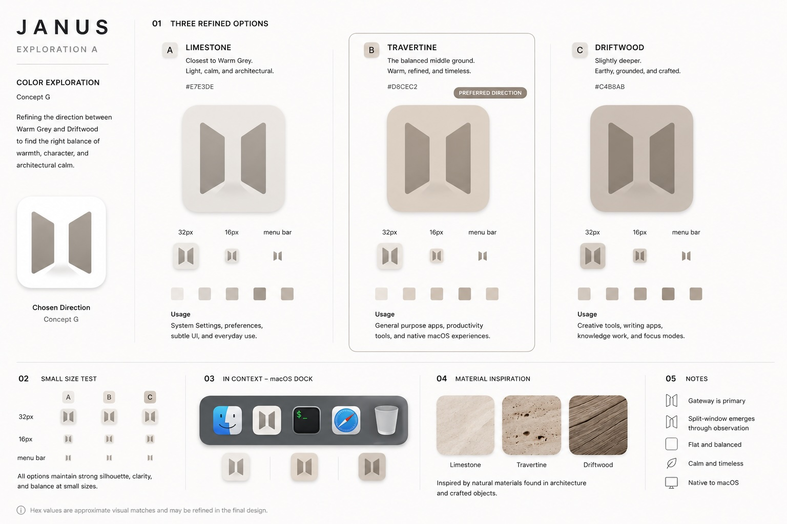

# Janus Brand Foundation

This document is the source of truth for evaluating whether Janus branding,
copy, visuals, onboarding, and product decisions feel on-brand.

The practical question is:

> Does this decision make Janus feel more thoughtful, native, approachable,
> predictable, and calm?

## Brand Mission

Janus helps macOS users create order from complexity through thoughtful window
management.

## Brand Promise

Janus adapts to the way you work instead of forcing you to adapt to the way it
works.

## Positioning

Janus is a thoughtful macOS window manager focused on helpful defaults, natural
workflows, and approachable configuration.

Janus should feel like a native Mac app first and a tiling window manager
second.

## Core Principles

### Thoughtful

Every feature should feel considered. Janus should avoid surprising users,
moving windows without clear intent, or adding complexity just because it is
technically possible.

### Native

Janus should feel like it belongs on macOS. Prefer platform conventions,
familiar controls, readable language, and behaviors that fit the rest of the
system.

### Approachable

Janus should not require users to understand tiling window manager vocabulary,
write configuration files, or memorize workflows before the app becomes useful.

### Predictable

Windows should behave in ways users can quickly understand. When Janus moves a
window, the reason should be visible from the current interaction.

### Flexible

Power users can go deeper over time, but deeper control should not make the
default experience heavier for beginners.

## Visual Themes

### Primary

- Gateway
- Threshold
- Transition
- Flow

### Secondary

- Duality
- Reflection
- Balance
- Workspace

### Avoid

- Roman imagery
- Faces
- Ancient architecture
- Hacker aesthetics
- Linux window manager aesthetics

## Design Influences

Janus draws inspiration from architecture, mid-century modern design, and
optimistic retro-futurism.

The goal is not nostalgia. The goal is timelessness.

Like the best mid-century objects, Janus should feel thoughtfully designed,
approachable, and useful. Technology exists to reduce friction and improve
everyday workflows, not to demand attention.

Visual references include architectural thresholds, natural materials,
modernist typography, and the human-centered optimism of classic
Tomorrowland-era design.

Janus should feel less like a developer tool and more like a well-crafted
object.

## Canonical Brand Reference

The current Janus visual direction is represented by the Concept G + Travertine
icon exploration.

This image should be treated as the primary visual reference for future design
work. It is not just a logo draft; it is the result of the current brand
decisions around Janus.

Key attributes:

- Gateway is the primary symbol.
- Split-window is revealed through observation.
- Architectural rather than technological.
- Calm rather than energetic.
- Thoughtful rather than powerful.
- Material-inspired rather than software-inspired.
- Mid-century modern and optimistic retro-futurist influences.
- Native to macOS.
- Timeless over trendy.

Future UI, onboarding, documentation, website, screenshots, and marketing work
should align with these principles.

## Color Direction

### Primary

- Slate blue

### Supporting

- Cool gray
- Charcoal
- Off-white

Color should feel calm and capable rather than loud, playful, or aggressive.
Avoid palettes that make Janus feel like a terminal-first tool or a mythology
reference.

## Voice And Tone

### Good

- Calm
- Helpful
- Confident
- Direct

### Bad

- Clever
- Snarky
- Aggressive
- Technical for its own sake

Janus copy should explain what is happening in plain language. It should avoid
inside jokes, unnecessary jargon, and power-user posturing.

## Brand Checks

Use these questions when making product, documentation, visual, or copy
decisions:

- Does this feel thoughtful?
- Does this feel approachable?
- Does this feel native to macOS?
- Does this reduce friction?
- Does this preserve user control?
- Does this make Janus easier to understand without extra documentation?

## Feature Examples

If Janus requires editing a configuration file before it does anything useful,
that is a brand violation.

If Janus launches with good defaults and optional customization, that is brand
alignment.

If Janus adds another layout option before the basic window movement primitive
is reliable, that is a brand violation.

If Janus makes managed and floating window states visible, reversible, and easy
to change, that is brand alignment.

## Icon Brief

Create a macOS application icon representing a gateway formed from two mirrored
window-like panels. The gateway should be recognizable at small sizes and should
reveal the window metaphor only upon closer inspection.

The design should communicate thoughtfulness, balance, transition, and calm.

Avoid literal Roman imagery, faces, columns, ancient architecture, or mythology
references.

## Future Visual Exploration

When Janus is ready for icon exploration, generate several rough concepts
around the dual-panel gateway direction before choosing a final icon. The goal
is to explore the shape language, silhouette, depth, and macOS fit before
polishing one direction.
